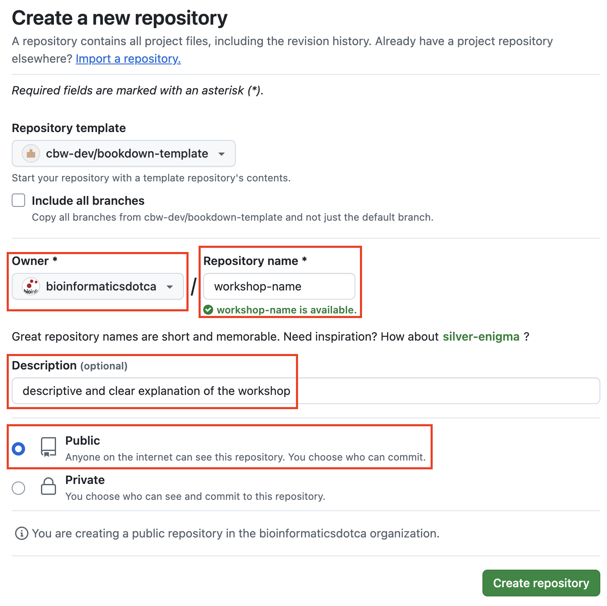

# (PART) Set Up Workshop Site {-}

# Create your repo {#create-repo}

1. Go to the **[bookdown template](https://github.com/cbw-dev/bookdown-template)**.
    
2.  **Click on the "Use this template"** green button, which is to the right of the title of the repository "bookdown-template". Then, press the dropdown option: "**Create a new repository**", as seen below.

    ::: {.callout type="green" title="Check your action's progress" collapsible="true" style="plain" icon="true"}
    To check the progress of this configuration, click Actions in the top bar.
    :::

3. You will be brought to a "Create a new repository" page. Fill out the blanks as follows:
  * Change the **owner** to "bioinformaticsdotca"
  * Make it **public**
  * Fill in the **repository name** with your workshop code (e.g. INR_Mon-2510)
    

    ::: {.callout type="gray" title="See image" collapsible="true" style="plain" icon="fa-solid fa-image"}
    \
     
    :::

4. Click `Create Repository`.
