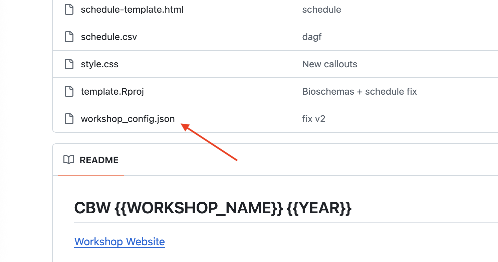

# Configure your repo {#configure-details}
These steps will auto-configure your workshop with certain variables. Note that this is a one-time process and the configure_workshop.json file will disappear afterwards. Don't worry - if you have changes (e.g. new faculty) later on, you can always change the website.

1.  Open your new repo's configure_workshop.json file in your browser.

    ::: {.callout type="gray" title="See image" collapsible="true" style="plain" icon="fa-solid fa-image"}

    \ 

    :::

2.  Click Edit.     

    ::: {.callout type="gray" title="See image" collapsible="true" style="plain" icon="fa-solid fa-image"}
    \ 
    :::

3.  Replace all the variables, then click Commit.

    ::: {.callout type="gray" title="See image" collapsible="true" style="plain" icon="fa-solid fa-image"}
    \ 
    :::

4.  Click commit changes.

    ::: {.callout type="gray" title="See image" collapsible="true" style="plain" icon="fa-solid fa-image"}
    \
    :::

5.  To check the progress of this configuration, click Actions in the top bar.

    ::: {.callout type="gray" title="See image" collapsible="true" style="plain" icon="fa-solid fa-image"}
    \
    :::

### A note on repos vs websites {#workshop-vs-repo}

An important distinction:  

**GitHub** (ex. https://github.com/cbw-dev/bookdown-template) holds your repo, which has version control for all your files.  
The deployed **website** (ex. https://cbw-dev.github.io/bookdown-template/) has the workshop online. It looks in the `docs` folder of your repo for HTML files to display.

:::: {.callout type="gray" title="More details" collapsible="true" style="plain" icon="true"}

You've made a *repository* that holds what GitHub needs to make our *website*. When updating the site you'll edit the markdown (.md) files in the main folder; they'll be turned into HTML files by the Build action later on. The template has been configured so that these HTML files that make up our website go into a folder called `docs`. In the next step, we'll tell GitHub to look at the `docs` folder to find our website files and make it available to see online (a.k.a deploy it). 
    
::::
