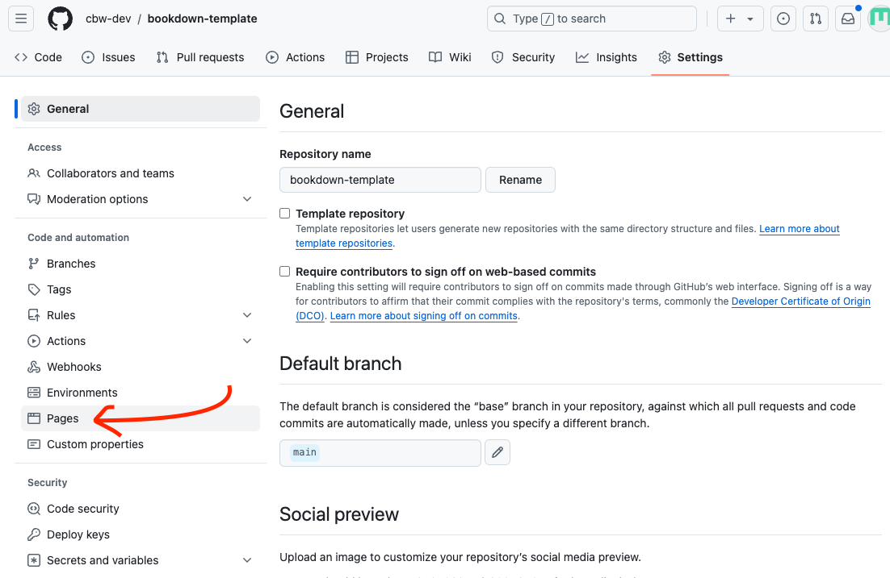
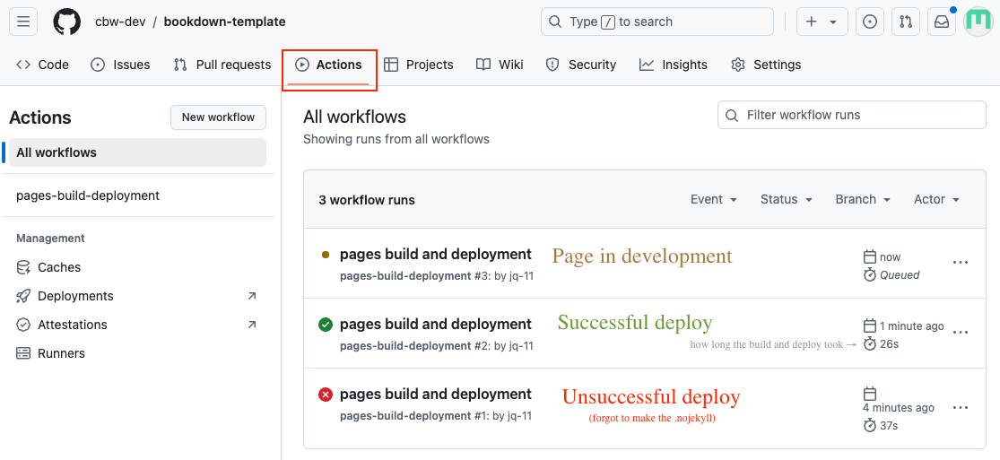
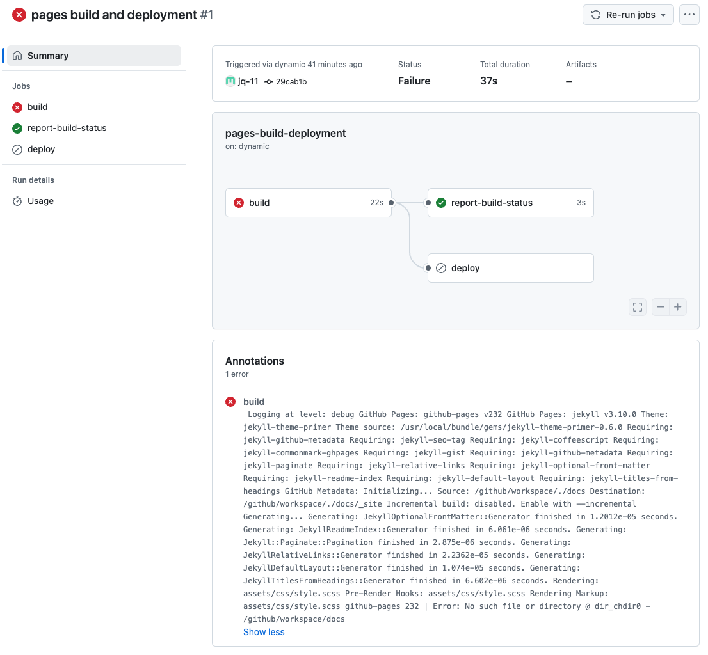

# Deploy your site {#deploy-website}

1.  In the top navigation bar, select **Settings**.

    ::: {.callout type="gray" title="See image" collapsible="true" style="plain" icon="fa-solid fa-image"}
    
    :::

2.  Then, go to the **Pages** sidebar option.

    ::: {.callout type="gray" title="See image" collapsible="true" style="plain" icon="fa-solid fa-image"}
    
    :::

3.  "Deploy from a branch" is already selected, which is what we want. We must **change the branch from "none" to "main"**. Select the "None" dropdown button and select "main".

    ::: {.callout type="gray" title="See image" collapsible="true" style="plain" icon="fa-solid fa-image"}
    \
    :::

4.  Change the folder from `/root` to `/docs` and press **save**.

    ::: {.callout type="gray" title="See image" collapsible="true" style="plain" icon="fa-solid fa-image"}
    \
    :::
    
Great! Now we're waiting on the page to build and deploy, which should take less than a minute.
  
## Check your deploy and see your website! {#check-deploy}
        
To see updates, go to the **Actions** page (found along the top navigation bar. This will help you understand how the deploy is working, and if it succeeded or failed.

::: {.callout type="gray" title="See image" collapsible="true" style="plain" icon="fa-solid fa-image"}

\

:::

You can click <u>**pages build and deployment**</u> for updates.

::: {.callout type="gray" title="See image" collapsible="true" style="plain" icon="fa-solid fa-image"}

\

:::

A **successful deploy** will have a green checkmark next to it. You can inspect the 3 steps: build, report-build-status, deploy. Once it's done deploying, **you can find the website at the link provided under the "deploy" step**!

::: {.callout type="gray" title="See image" collapsible="true" style="plain" icon="fa-solid fa-image"}

\

:::

A **failed deploy** will have a red cross next to it. Clicking through the steps can help you determine what went wrong in the deploy.

::: {.callout type="gray" title="See image" collapsible="true" style="plain" icon="fa-solid fa-image"}

\

:::

::: {.callout type="orange" title="Important!" style="subtle" icon="true"}

Warning: A website can build properly, but may not deploy properly! It is a good idea to check after making big changes.

:::

#### A very specific build and deployment warning {-}

This is a very specific (and unlikely) warning. It occurs when 1 deploy hasn't finished, but another deploy began. This is a warning message you do not have to worry about!

::: {.callout type="gray" title="See image" collapsible="true" style="plain" icon="fa-solid fa-image"}

\

:::
