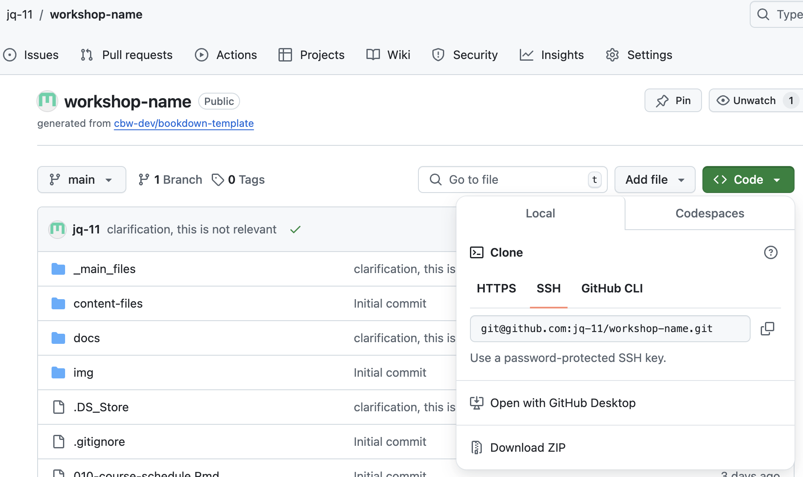

# Faculty team setup {#faculty-team}

1.  Go to the [bioinformaticsdotca organization teams page](https://github.com/orgs/bioinformaticsdotca/teams)
2.  Create a team named as your workshop code (e.g. INR_Mon-2510). Leave all settings as their defaults
3.  Add your instructors and TAs to the team. Note that this will send them an email invite that they must accept.
4.  On your repo page on GitHub's website, navigate to Settings > Collaborators and Teams. Click "Add Teams" and select your team.

    ::: {.callout type="gray" title="See image" collapsible="true" style="plain" icon="fa-solid fa-image"}
    
    \
    
    :::

5.  Give your team Maintain access


::: {.callout type="orange" title="Important note on access" style="plain" icon="fa-solid fa-triangle-exclamation"}

**Do not give direct repository access to individuals!** Always use team access. This allows us to better control the security of our repositories.

:::


# Clone to your computer {#clone}

Now that the website is created, let's bring it to your computer where you can easily make edits. We'll use the `git clone` command for this.

1.  Navigate to the folder you created in [Local Setup](#local-setup) using Terminal/Windows PowerShell/Command Prompt.

    ::: {.callout type="blue" style="subtle" title="Opening your folder in the command line"}

    You can use the cd command to navigate. Some easier options, if you prefer:
    
    On **Windows**  
    *Method 1*: Shift + Right-click  
    * Open Windows File Explorer and navigate to the folder you want to open in the terminal.  
    * Hold down the Shift key and right-click on the folder (or an empty area within the folder).  
    * Select "Open in Terminal" from the context menu.   <br>
      
    *Method 2*: Typing "cmd" in the address bar  
    * Open Windows File Explorer and navigate to the folder.  
    * Click in the address bar at the top of the window.  
    * Type `cmd` and press Enter. <br><br>
    
    On **Mac**  
    * Locate and open the folder you want to use in Finder. 
    * If you don't see the path bar at the bottom of the Finder window, go to View > Show Path Bar. 
    * In the path bar, right-click (or Control-click) the folder. 
    * Select Open in Terminal <br><br>

    Note that the `pwd` command gives you the *path to your working directory*. You may want to use this in your CBWGithub folder and paste the output somewhere where you can quickly find it, so it is easier to navigate to in the future.
    
    :::

2.  Get your repo's SSH URL.

    Find the ssh for your workshop repository:

    a)  Click the green button entitled `< > Code` and see the drop down options.

    b)  Click the SSH tab, as seen below, and then copy the text below it. The text should be something like [git\@github.com](mailto:git@github.com){.email}:bioinformaticsdotca/WORKSHOP-NAME.git, as seen below. 
    
        ::: {.callout type="gray" title="See image" collapsible="true" style="plain" icon="fa-solid fa-image"}
        \
        :::

    c)  **Edit** and **run the following command** in Terminal/PowerShell/Command Prompt, within the folder you want the workshop folder to be in. (Recall that we navigated there in step 1.)

    ::: {.callout type="red" title="Edit this command!"}

    Type "git clone ", paste the SSH url, and then hit enter. The command is below, but you must delete the entire "git\@github.com:bioinformaticsdotca/[YOUR WORKSHOP NAME].git" text, and replace it with the text you copied.
    
    ```         
    git clone git@github.com:bioinformaticsdotca/[YOUR WORKSHOP NAME].git
    ```
    
    ::::

3.  You should be ready to go! With your given permissions, you should be able to git push (put your local edits on GitHub) and git pull (pull edits on GitHub to your local computer) fine!
