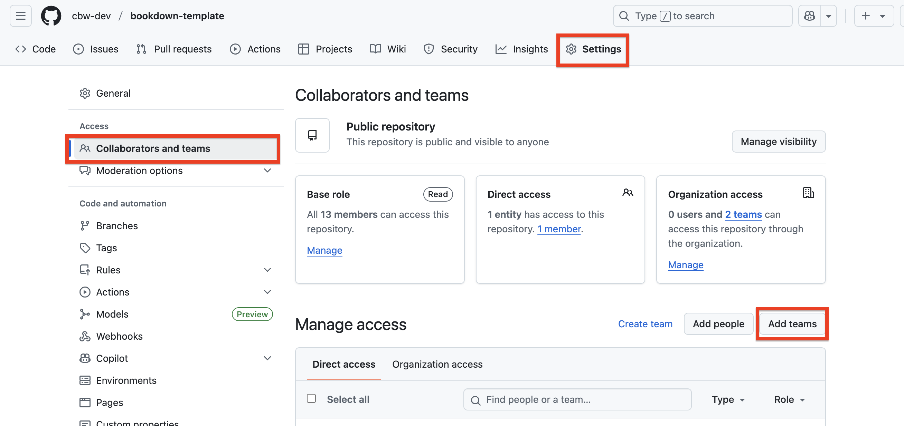

# Faculty team setup {#faculty-team}

1.  Go to the [bioinformaticsdotca organization teams page](https://github.com/orgs/bioinformaticsdotca/teams)
2.  Create a team named as your workshop code (e.g. INR_Mon-2510). Leave all settings as their defaults
3.  Add your instructors and TAs to the team. Note that this will send them an email invite that they must accept.
4.  On your repo page on GitHub's website, navigate to Settings > Collaborators and Teams. Click "Add Teams" and select your team.

    ::: {.callout type="gray" title="See image" collapsible="true" style="plain" icon="fa-solid fa-image"}
    
    \
    
    :::

5.  Give your team Maintain access

::: {.callout type="orange" title="Important note on access" style="plain" icon="fa-solid fa-triangle-exclamation"}

**Do not give direct repository access to individuals!** Always use team access. This allows us to better control the security of our repositories.

:::
