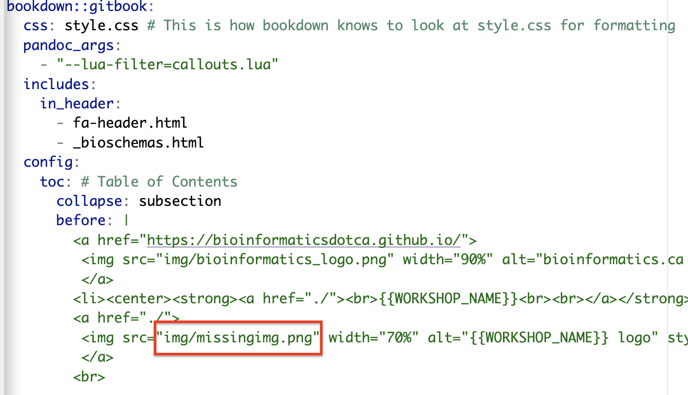
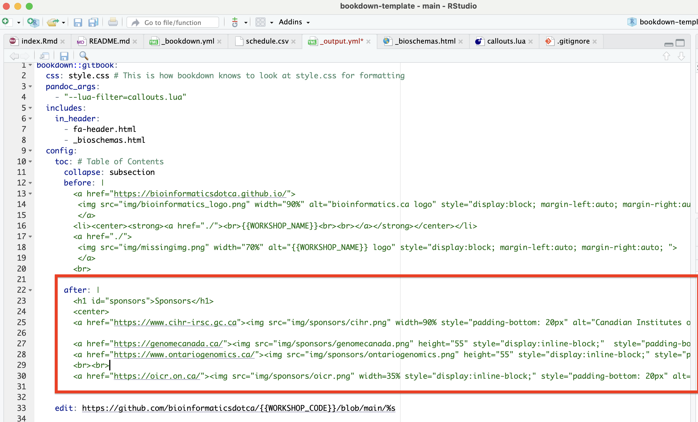
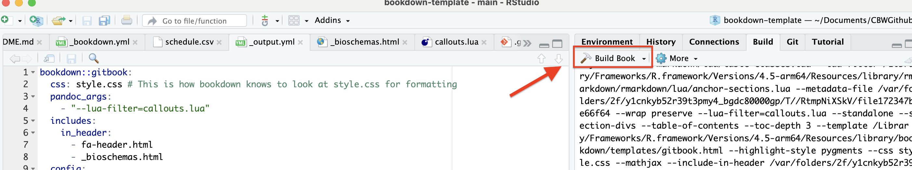
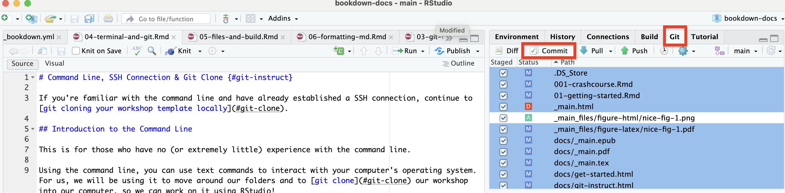
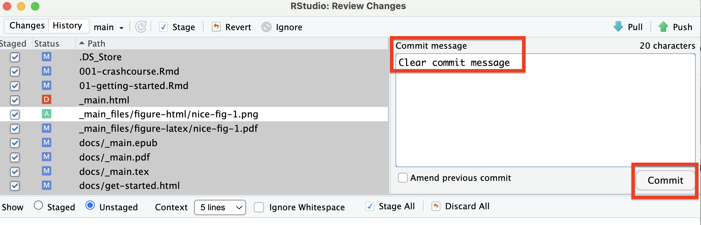
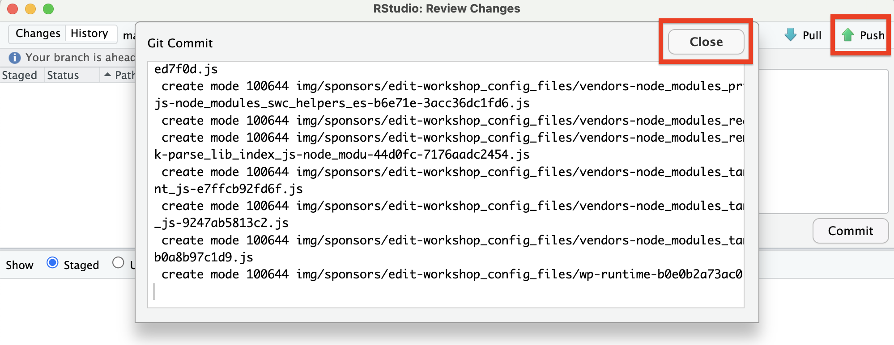

# Finishing touches {#finishing-touches}

1.  Open the .Rproj file in the folder you've just downloaded
2.  Upload your workshop icon to the ``img/`` folder and any sponsor logos to the `img/sponsors` folder
3.  In _output.yml, replace ``missingimg.png`` with your icon's filename

    ::: {.callout type="gray" title="See image" collapsible="true" style="plain" icon="fa-solid fa-image"}
    
    \
    
    :::

4.  In the same _output.yml file, add any sponsors not already included. To do this, copy one of the existing sponsor lines and change each section. Use the `height` or `width` attributes to change how large the images are. If two images are small enough and there is no `<br>` tag in between, they will be displayed side by side like the Genome Canada and Ontario Genomics logos. 

    ::: {.callout type="gray" title="See image" collapsible="true" style="plain" icon="fa-solid fa-image"}
    
    \
    
    :::


4.  Hit "Build Book" and check preview once complete. Note that you may need to adjust sizing of sponsor logos and build again.

    ::: {.callout type="gray" title="See image" collapsible="true" style="plain" icon="fa-solid fa-image"}
    
    \
    
    :::

5.  Commit and push

    Check off all files you want to save to Git in the Git window pane, then click Commit.

    ::: {.callout type="gray" title="See image" collapsible="true" style="plain" icon="fa-solid fa-image"}
    
    \
    
    :::
    
    Enter a clear commit message and click Commit.
    
    ::: {.callout type="gray" title="See image" collapsible="true" style="plain" icon="fa-solid fa-image"}
    
    \
    
    :::
    
    Close the confirmation popup and click "Push" to send all files to Github.
    
    ::: {.callout type="gray" title="See image" collapsible="true" style="plain" icon="fa-solid fa-image"}
    
    \
    
    :::
    
6.  The website takes 1-2 minutes to build after a new push. To check the progress of this action, click Actions in the top bar on Github.

    ::: {.callout type="gray" title="See image" collapsible="true" style="plain" icon="fa-solid fa-image"}
    \
    :::


## Oops, I Git Cloned the Wrong Repository! {#delete-git-folder-locally}

That's okay! To delete the entire local repository and the folder itself, run the following command:

```         
rm -fr folder-path
```

where "folder-path" is a file address to the repo that you want to delete. *Double check that the path is correct before running this command.*
