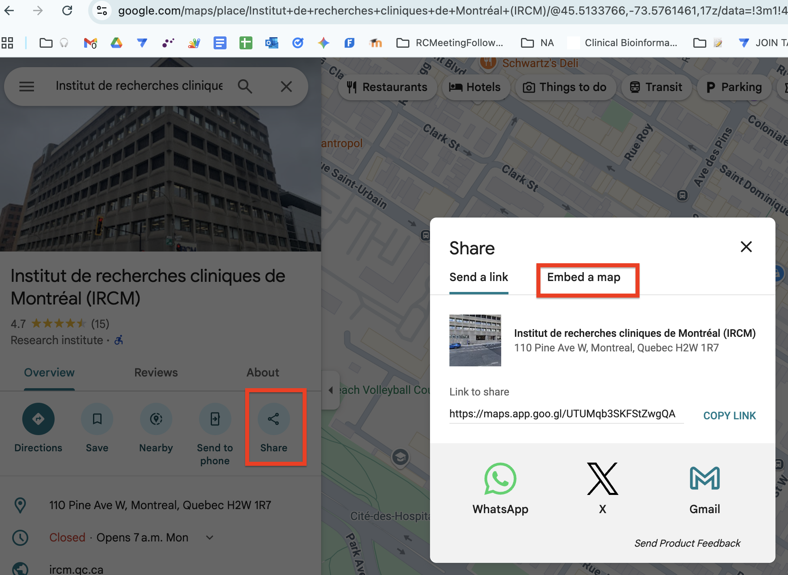
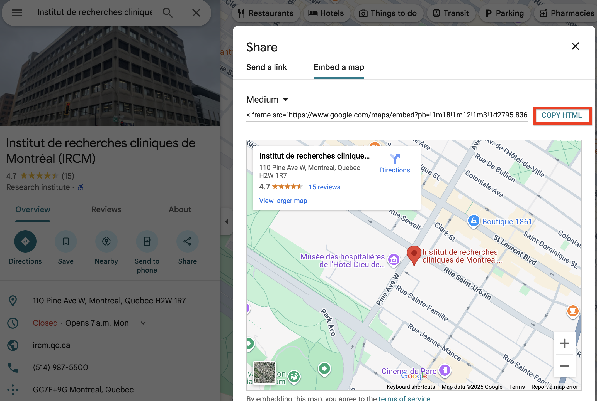

# Logistics page {#logistics}

If your workshop has an in-person location, you'll need to create a travel logistics page for your participants.

::: {.callout type="orange" title="Important note" style="subtle"}

**Do not link this page on your workshop website!** To prevent uninvited guests, this link is *only* sent out by email directly to participants.

:::

## Create your logistics page {#create-logistics}

1.  Navigate to the `travel_logistics` folder you cloned as part of your [local setup](#github-folder).

2.  Make a copy of template.md named `[CODE].md` (e.g. `INR_Mon-2511.md`) in the folder for the city your workshop will be held in (e.g. `montreal`). If that folder does not exist, create it.

3.  Open the file in your editor, likely VSCode, and fill in each section. Be careful not to miss anything.

    :::: {.callout type="gray" title="Embedding Google Maps" collapsible="true" style="plain" icon="fa-solid fa-image"}
    
    You'll need to embed a Google Maps for your venue. To do this, find your venue on Google Maps and click Share, then Embed A Map.
        
    \
      
    Click Copy HTML, then paste it into your logistics document.
      
    \
    
    ::::

4.  Git add, commit, and push your changes.

5.  Your workshop will be available at `bioinformaticsdotca.github.io/travel_logistics/[city]/[code]`. In the example above, the URL would be `bioinformaticsdotca.github.io/travel_logistics/montreal/INR_Mon-2511`

::: {.callout type="yellow" title="Looking for previous examples?" collapsible="true" style="subtle"}

You're welcome to review previous years' logistics pages and copy as appropriate - just make sure the info is up to date! Links to legacy (pre-Hub) pages are below.

* [Vancouver](https://bioinformaticsdotca.github.io/travel_logistics/legacy/vancouver)
* [Calgary](https://bioinformaticsdotca.github.io/travel_logistics/legacy/calgary)
* [Edmonton](https://bioinformaticsdotca.github.io/travel_logistics/legacy/edmonton)
* [Ottawa](https://bioinformaticsdotca.github.io/travel_logistics/legacy/ottawa)
* [Quebec City](https://bioinformaticsdotca.github.io/travel_logistics/legacy/quebeccity)
* [St. John's](https://bioinformaticsdotca.github.io/travel_logistics/legacy/stjohns)
* [Toronto](https://bioinformaticsdotca.github.io/travel_logistics/legacy/toronto)

:::
