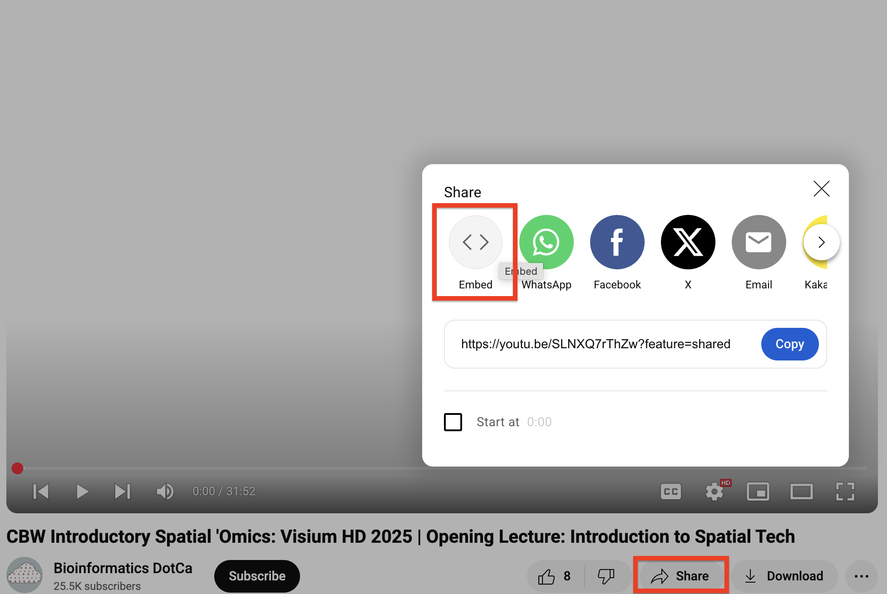
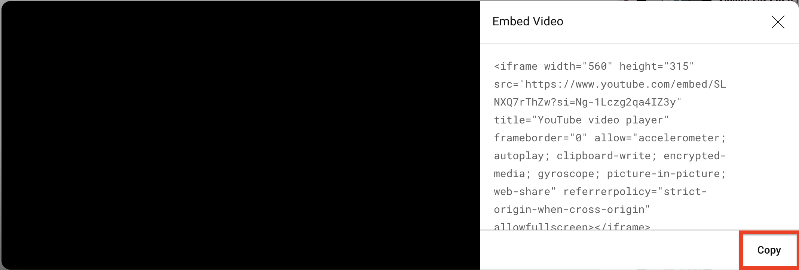

# What's next? {#whats-next}

Now that you have your repo set up, you can start filling it out! Some of the details you'll need to include are below.

:::: {.callout type="red" title="Remember to pull first!" style="subtle" icon="fas fa-circle-info"}

**Remember to always run `git pull` before making changes**. It doesn't matter if you do this in RStudio or the command line, but it will save you serious headaches down the road.

::::

## Homepage
The index.Rmd file creates your landing page, which has a few different components.

### Pre-work
[Uncomment](#commenting) this line and enter the responder link to your pre-work form when ready.

### Schedule
Your schedule will be created using a special tool. To update the schedule, you'll update the schedule.csv file. You do not need to edit anything in index.html - the R chunk will create the schedule for you. 

1.  Open your schedule file in Google Drive. Copy the times and contents of Day 1, excluding headers. If you have multiple time zones, only include one - the utility will auto-calculate other time zones.

    ::: {.callout type="gray" title="See image" collapsible="true" style="plain" icon="fa-solid fa-image"}

    \
    <br>
    
    :::

2.  Open the smart scheduler utility below. Select the time zone corresponding to your copied data in the dropdown. If this is a distributed (or virtual) workshop, select other relevant time zones.

3.  Select the date of day 1 and paste your copied schedule data. 

4.  For all other days, click "Add Another Day" and repeat. 

5.  Click Generate CSV and then Copy to Clipboard.

    ::: {.callout type="blue" title="Smart Scheduler utility" collapsible="true" style="plain" icon="fa-solid fa-gear"}
    
    ```{r, echo=FALSE}
    htmltools::tags$iframe(
      src = "smart_scheduler.html",
      height = "850",
      style = "width: 100%; min-width: 650px; border: none;"
    )
    ```
    
    :::

6.  Open schedule.csv, delete all contents, and paste your newly formatted schedule.

7.  After your next build, the schedule will be visible on the landing page.

### Class photo
1.  After you take your class photos, upload them into your Google Drive's PostWorkshop/ClassPhoto folder. Choose the best one and name it CODE_ClassPhoto (e.g. INR_Mon-2510_ClassPhoto). Make sure its permissions are set to Everyone Can View.

2.  Double-click the photo, use the three-dot menu, and click "Open In New Window".

    ::: {.callout type="gray" title="See image" collapsible="true" style="plain" icon="fa-solid fa-image"}
    \
    <br>
    :::
    
3.  Use the three-dot menu and select Embed Item. 
    
    ::: {.callout type="gray" title="See image" collapsible="true" style="plain" icon="fa-solid fa-image"}
    \
    <br>
    :::

4.  Copy the embed code and paste it below the Class Photo header in your index.Rmd.

5.  You can edit the width and height attributes to change the image dimensions, or delete them entirely to have the image autosized (not recommended for very large images).


## Faculty pages
Copy the below code into the 001-faculty.Rmd file and complete for each faculty member. You'll need to upload their headshots to the `img/faculty` folder.

``` r {eval=FALSE, echo=TRUE}
#### NAME


>JOB TITLE <br>
INSTITUTION <br>
LOCATION
>
> --- CONTACT INFO, IF PROVIDED

BIO GOES HERE
```

## Computing
In 002-computing.Rmd, you'll include information on your data and computing setup.

If your workshop includes compute, add data download links, AWS AMI/Magic Castle instructions, etc.

If your workshop does not use compute, remove "And Compute Setup" from the top-level header and delete the Compute Setup section.


## Modules

### Embedding slides
Copy the below code chunk and paste into your slide. Replace `GOOGLE SLIDES LINK` with the URL of your slides *up to the word edit/*. The `/preview` in the code chunk will ensure that the slides are formatted for optimal viewing.

``` {r echo=TRUE, eval=FALSE}
<iframe src="GOOGLE SLIDES LINK/preview" width="640" height="480" allow="autoplay"></iframe>  
```

Ensure the share settings for your slides are set to Everyone Can View.

Google Slides allows users to download slide decks in PPTX and PDF formats from the embed view.

### Embedding YouTube videos

1.  On your YouTube video, click **Share** then **Embed**.

    ::: {.callout type="gray" title="See image" collapsible="true" style="plain" icon="fa-solid fa-image"}
    \
    <br>
    :::

2.  Copy the embed code provided.

    ::: {.callout type="gray" title="See image" collapsible="true" style="plain" icon="fa-solid fa-image"}
    \
    <br>
    :::

3.  Paste into your Bookdown project. Edit code to set *width* to 640 and *height* to 360.


### Adding lab material
RCs and faculty can add lab material directly into your bookdown website. Use the details in the Formatting section below to include features like code chunks, callouts, and images.

## Bioschemas
The `_bioschemas.html` file contains the Bioschemas metadata. It is mostly complete, but you'll need to update:  

* *inLanguage* if the language is not English  
* *keywords* with 3-5 keywords  

## What if I need to add a new file or change the existing file structure?
Bookdown renders the Rmd files in the main repo in alphabetical order, hence the numbers at the beginning of each file. To create a new file, simply name it starting with the numbers that place it where you want it in your output website.

For instance, if you wanted to have a new page between modules 2 and 3, you could name your file 0025-mynewfile.Rmd.

You can also rename all files or delete them and start over, if you like - this is a suggested structure.
