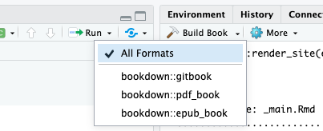

# Bookdown crash course {#bookdown-crash-course}

## How Bookdown works {#how-bookdown-works}

Here is a general summary of how Bookdown creates html websites from .Rmd files when you hit Build.


Essentially, **Knitr renders and runs all the code**, and the outputs are converted into markdown. After knitr, we essentially have a bunch of only markdown files.

**Pandoc translates this markdown into HTML**, so that we get a website! It can be helpful to know when and how these packages work, to help debug later on. 

:::: {.callout type="blue" style="subtle" title="Note!"}

The Build step is *required* for changes to be reflected on the website. If you push an update and the site looks the same, you probably forgot to build.

::::

## File setup {#file-setup}

All .Rmd files create a page in the produced website. To create more pages, you will be creating more .Rmd files.

Here is a tree diagram of the bookdown template setup. **Note:** only relevant files or files you might be concerned about are explained in blue. If there is no explanation, you can safely assume you do not have to worry about it.

```{bash, eval=FALSE}
bookdown-template
├── _404.md # This becomes your 404 page. This is the only file that can become a page that can also be either a .md or .Rmd file!
├── _bioschemas.html # contains the Bioschemas metadata used by websites like TeSS ELIXIR
├── _bookdown.yml # a config file - you most likely won't have to edit it unless you want additional configuration settings
├── _bookdown_files
├── _main_files
    └── ... # output figures for certain formats
├── _output.yml # a config file - RC will edit it to include sponsors and workshop icon
├── .github
    └── ...
├── .git
    └── ...
├── .gitignore
├── .Rhistory
├── 001-faculty.Rmd # --> faculty bios
├── 002-computing.Rmd # --> computing setup and downloads
├── 010-module 1.Rmd # --> module 1 material
├── 020-module-2.Rmd 
├── 030-module-3.Rmd
├── 040-module-4.Rmd
├── 404.html # Rendered 404 page
├── README.md # README file - this directs people looking at the GitHub repo to the rendered site
├── book.bib # citation file
├── callouts.lua # Lua filter that defines the callout options
├── cbw-workshop-year.html
├── {{CODE}}.Rproj # always open this file in RStudio when starting to edit!
├── content-files # store all files from your modules here (ex. data sets, empty code worksheets)
    └── sample-pdf.pdf
├── docs
    └── ... # html files & other generated content
├── fa-header.html
├── img # folder where you should store all your images
    ├── bioinformatics.ca-logo.svg 
    ├── faculty # store all images of faculty in this folder
        ├── michelle-brazas.jpg
        └── nia-hughes.jpeg
    ├── favicon.ico # thumbnail image for website in tab
    └── sponsors # store all sponsor logos/titles in this folder
         └── Your-Sponsor-Here.svg
├── index.Rmd # landing page
├── packages.bib # R generated citation file
├── preamble.tex
├── README.html # rendered readme file
├── schedule.csv # contents of your schedule on the landing page; formatted by smart-scheduler utility
├── style.css # css styling options are defined here - feel free to add your own styling features
└── workshop_config.json # used to configure your website. Note that this file will disappear after use
```

### \_output.yml & \_bookdown.yml {-}
2 important files are the `_output.yml` files and the `_bookdown.yml` files. They help tell bookdown what we want and what to do, especially when making our website.

RCs will only have to edit _output.yml a bit. The _output.yml file creates the table of contents/sidebar you see on the left of the workshop. It is written in HTML, which is why it looks so different. There are 2 things either the RC or the workshop team will need to do:

1.  Add your workshop icon
2.  Add your sponsors

### Organizing the TOC: .Rmd files {-}

The order of the sidebar is completely dependent on the alphabetical order of the files. Our template has Rmd files starting with numbers to make this easy. The only file without this is `index.Rmd`, since as the landing page we can not change the file name.

#### index.Rmd {-}

The only .Rmd that must have some configuration details is the landing page: **index.Rmd**. This is what fills up the beginning of the index.Rmd file, surrounded by the \-\-\-, which tells bookdown the configuration information.

The contents of this file after the configuration block make up your homepage.

#### All other .Rmd files {-}

Let's move on to discussing the breakdown of the .Rmd files. Each new page is defined by a new header, which starts with `#`; each sub-header has increasingly more `#` symbols (##, ###, and more all create smaller sub-headers). A "main" header only has 1 `#` symbol. These headers define new pages, as well as the title in the sidebar referring to that page.

Hence, if we have multiple "main" headers in 1 .Rmd file, 1 .Rmd file will encode multiple pages. Try to have only 1 single # as a header on one page - you may get warnings otherwise.

However, if a new file only has sub-headers (2 `#` or more), the sub-header will appear on the page that was defined by the previous .Rmd file (in alphabetical order - see the order of the "File" window pane).

*Note:* Due to this, you may receive this warning:

> Warning message: <br>
In split_chapters(output, gitbook_page, global_numbering, split_by,  : <br>
  You have 6 Rmd input file(s) but only 4 first-level heading(s). Did you forget first-level headings in certain Rmd files?

You can ignore this warning message.

#### How to create a new file {-}

You can create new files anywhere. You should only be making new website pages, so you should also only be making .Rmd files. (Creating new .md files in hopes of making a new page usually ends up with weird bugs - stick to .Rmd files). 

1. Under the "Files" tab of the lower right window pane, there are many options to modify your files. You can use these buttons instead of your File Explorer. Click "New Blank File". 
2. Click the second dropdown option: R Markdown
3. Give your file a unique name that matches CBW's Bookdown template file naming convention, that is, "00XX-[description].Rmd". Decide what X should be depending on where you want the page to show up on your sidebar. Name your file a short but descriptive name, with hyphens (-) to split up words.
4. Start editing your new file in the upper left window.

#### 404 page {-}

That being said, there is one file that can be a markdown (.md) file: the _404.(R)md file. If website user goes to a webpage that belongs to our website but no longer exists, they will get this 404 page instead.

### Folders {-}
We want our workshops to be easy to navigate and understand. Images or files that are required for your lessons should be placed in `./img/` and `./content-files/` respectively. Within these files, try creating sub-folders within these folders to help organize groups of files. For example, if you have a bunch of data sets, try creating a "datasets" folder within `./content-files/`. Subfolders already exist in `./img`: `./img/faculty/` and `./img/sponsors/`.

:::: {.callout type="yellow" title="Best Practice" style="subtle" icon="fas fa-lightbulb"}

You can store small files like icons/headshots/generated plots in GitHub folders, but we recommend storing all other linked/embedded materials in your workshop's Google Drive for ease of access and organization. 

::::


###### Bookdown's website building folders {-}

Bookdown makes some folders to store .html files, among other files that help create the website. Hence, you should not need to touch:

- \_bookdown\_files
- \_main\_files
- docs

:::: {.callout type="yellow" title="Debugging Tips" style="subtle" icon="fas fa-lightbulb"}

**Debugging Tip 1**: If you do get an error that seems like it's coming from one of these files, there was probably an error that resulted from bookdown not being able to process something. Double check that your syntax, formatting, file names and related files are correct.

**Debugging Tip 2**: Each time we build, we produce a "docs" folder. If we have already built once, we just add new files to it. HTML files that were produced from .Rmd that were deleted are not removed. Hence, if you see errors from files that no longer exist in your root project folder, try deleting the whole docs folder, and rebuilding.

::::

:::: {.callout type="red" title="Warning!" style="subtle"}

*If you delete the docs folder, make sure to create an empty file, named *\".nojekyll\" *and put it inside the /docs folder. R-generated figures will not appear without this.*

::::


## Working with your Bookdown project in RStudio {#work-with-bookdown}

### Opening your Bookdown project {#open-bookdown}

Enter the folder you git cloned using Finder/File Explorer. Right click on the .Rproj file and press "Open in RStudio". There is only one file with this file extension. 

::: {.callout type="orange" title="Important!" style="subtle" icon="true"}

**This file is what you will open each time you want to work on this workshop.** You must explicitly **open the .Rproj** file to build properly!

:::

A RStudio window should open up and look something like the image below. 
\

## Explaining RStudio

In the bottom right, we have all of our files and subfolders. These files will be explained [below](#file-setup). This window also contains helpful views, like "Viewer" and "Plots". We will touch on these later.

Try opening `index.Rmd`: a new pane will open in the top left that shows the contents of `index.Rmd`. This is where we will be editing our files! Notice the "Knit" button.

In the bottom left, we have our console and other debug related windows. Any code we run will appear in the console. We can access the terminal under the "Terminal" tab - this is just like using the Terminal app.

In your top right, we have another pane with multiple views. The most relevant windows to us are the "Build" and the "Git" views. 

::: {.callout type="gray" title="No Git window?" style="subtle" icon="true"}

Try closing and then reopening RStudio. A "Git" tab should appear to the right of the "Build" tab and to the left of the "Tutorial" tab.

:::

## Build the Book

Try pressing "Build Book" within the "Build" window. Your build window is going to fill up with text, and soon, a website is going to pop up in a new window. 

::: {.callout type="gray" title="Note" style="subtle" icon="true"}

If it's your first time building, you may have to approve some downloads and installations, like we did in [the Install section](#installs).

:::

By building the book, **all** of these files are compiled and converted to .html files that create a website. Each time we make local changes to our files and we want them to appear in our website, we need to rebuild the book.

::: {.callout type="blue" title="Note" style="subtle" icon="true"}

By default, RStudio will choose to build "All Formats":
\
You can choose to only produce a gitbook (the first option). This can be helpful if you are encountering errors claiming that "bookdown::render_book() failed to render the output format 'bookdown::pdf_book'/bookdown::epub_book'". Additionally, not producing all output formats can decrease your build time significantly.

:::

### Other Ways to Build Your Book

1. Build the book from the R console:

```{r, eval=FALSE}
bookdown::render_book()
```

2. Press the keyboard buttons: `cmd + shift + B` (macOS) OR `ctrl + shift + B` (windows)

### Knit Your Book
Building can take a long time. If you are editing just one file, you can press the "Knit" button that is at the top of the window with your file. This will run the code in the page, and show you what that page would look like in the website (as well as saving that file).

A quicker way to knit is using the keyboard controls: `cmd + shift + K` (macOS) OR `ctrl + shift + K` (Windows)

**Note:** Other pages in your website will not update.

### Knit VS Build

Building creates the website using **ALL** the .Rmd (and other) files. This is why it takes so long. Knitting creates/updates **only** the .Rmd file you're currently working in and reruns your code. (Note: You can't knit a non-.Rmd file!)

Before pushing to GitHub, it is a good idea to build, in case of faulty links or small bugs that occur if you only knit or preview.

### Preview Your Book

If you want live updates to your changes, you can preview the page as you edit the book when you save individual .Rmd files. You can start the server in a work session by using the RStudio add-in "Preview book", or from the R console (in the bottom left window):

```{r eval=FALSE}
bookdown::serve_book()
```

## Pushing to GitHub {#push-to-github}

Now, we know what our files mean and how to edit them. How do we get this onto GitHub? We can write git commands into our Terminal/Command Prompt, or alternatively (and more easily), RStudio has a built-in git interface.

We have a Git window in the top right. Click "Git" to open this window.

\

Changed files that need to be updated on GitHub will show up in this window, like how `index.Rmd` is seen above. (Do not worry too much about `.DS_Store` and `.gitignore`.) Let's try to push this change to GitHub.

1. Select all the edited files.

    \

2. Click the Commit button, which appears above your selected items. A window pane will appear (shown below).

    \

3. Add a commit message in the corresponding box, and then press commit below it.

4. A new window will show up, detailing your updates. Close this window and then press **Push** to push your updates to GitHub.

    \

Git pushing will automatically update the website - you can see the updates and progress in the actions window we saw previously. (Check out your website on the web once it's done deploying! It takes approximately 1-2 minutes for the website to rebuild.)

::: {.callout type="red" title="Important: git pull" style="subtle" icon="true"}

You will probably not be the only person working on this repository: others will be pushing changes to GitHub as well. Before you edit your local material, you should **always** use the Pull button to get those updates. 

If one of your workshop team members made an edit, you want to have that edit on your computer before you start making changes! Otherwise, that's how you run into *merge conflicts*.

:::
